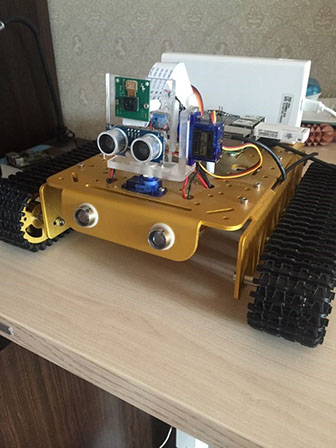
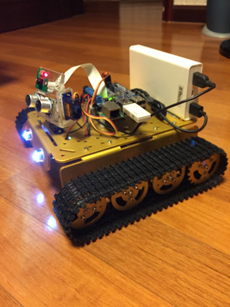
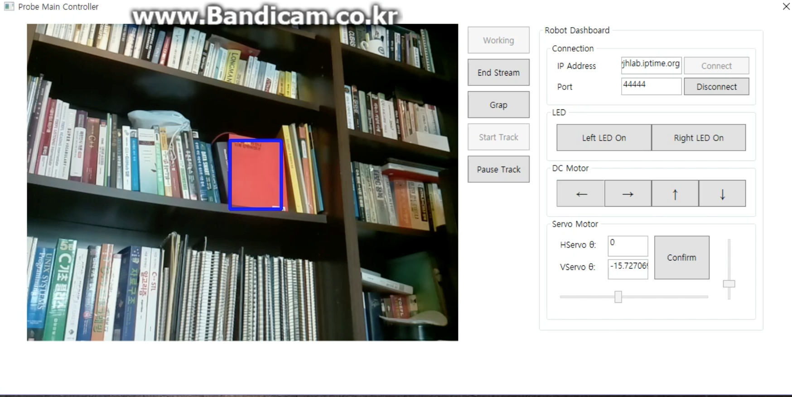

# ProbeController (Client Program, written in C# and WPF)

This project is for BS graudation project. It aims to control a remote robot using TCP/IP socket communication. It is like a command center for the remotely-located robot. 

The reason this program is needed is that the robot (raspberry pi) is normally not good at performing heavy tasks such as image processing, object tracking, and so on. Therefore, all heavy tasks are performed in this program and the corresponding actions (moving forward, moving backward, turn on the right, rotate robot's head, etc.) are genearted and sent to the robot accordingly. Upon these messages (actions) are received by the robot successfully, the robot will behave in a way the client software (this program) wants to do.

Through this program, it also make a robot to follow a certain object using meanshift object tracking algorithm. The robot rotates its head so that it always faces the object.

Sever-side program (written in python) is run on the robot.

